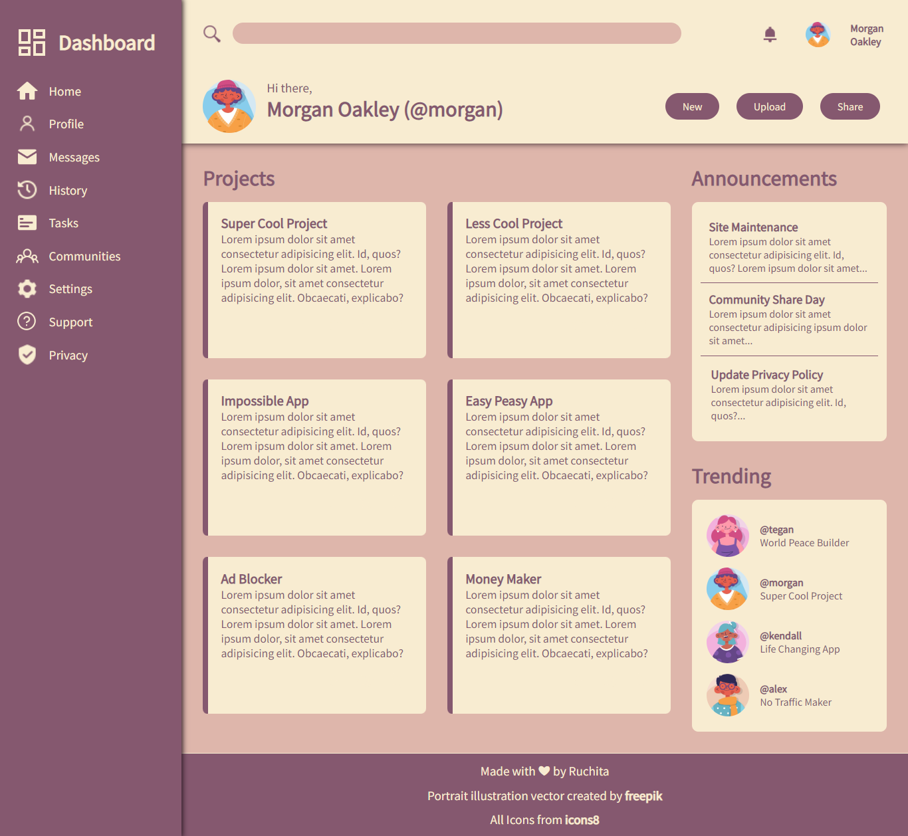

# Admin Dashboard
Admin Dashboard using HTML, CSS for The Odin Project

# Learnings
* Implicit and Explicit grid
* Line, tracks and cells in grid
* Two different ways of using grid-area
* Use of span and auto in grid
* resize:both (not related to grid but still glad to know)
* fractiona units (aka fr units)
* functions like repeat(), minmax(), clamp(), etc
* The power of auto-fit and auto-fill :) 🙌

# Preview

# Demo
👉 [Live Demo](https://ruchita1010.github.io/admin-dashboard)